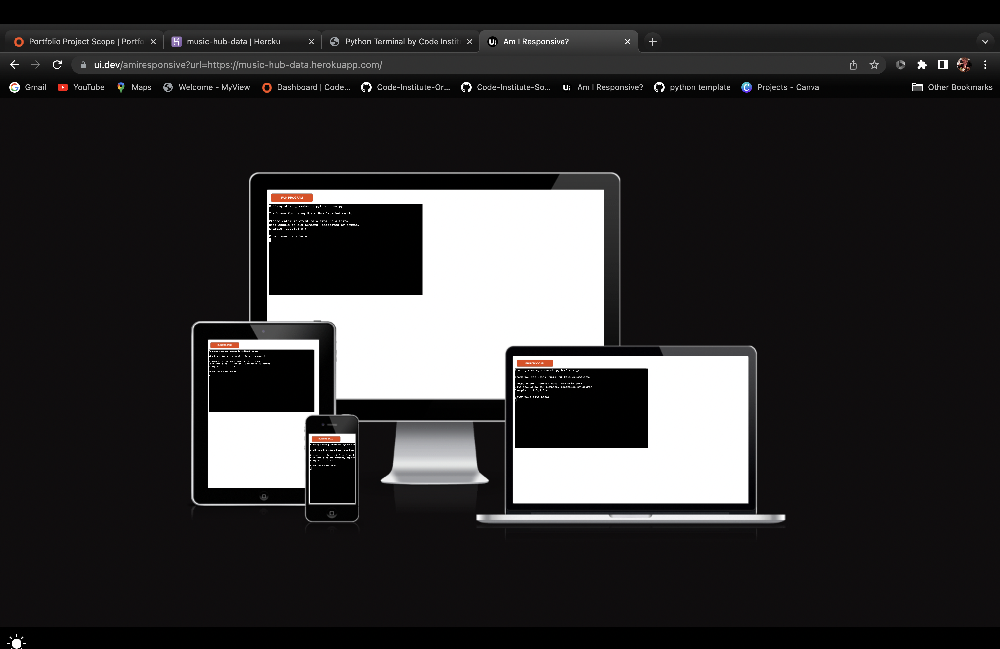
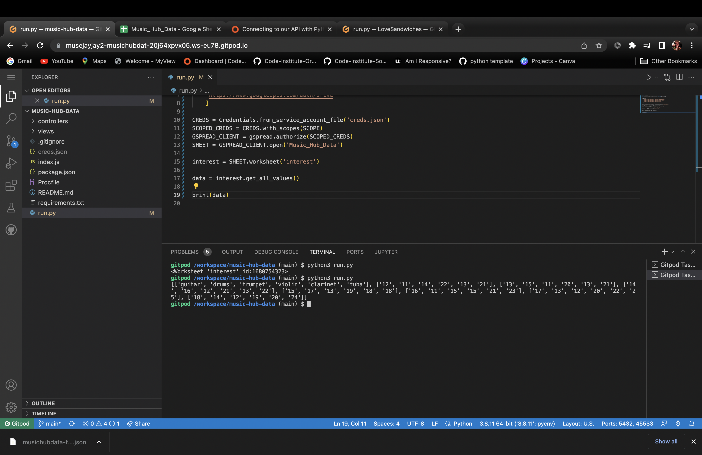
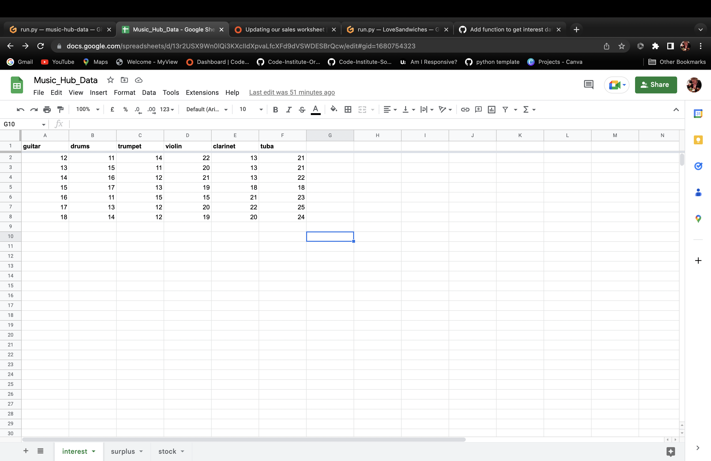
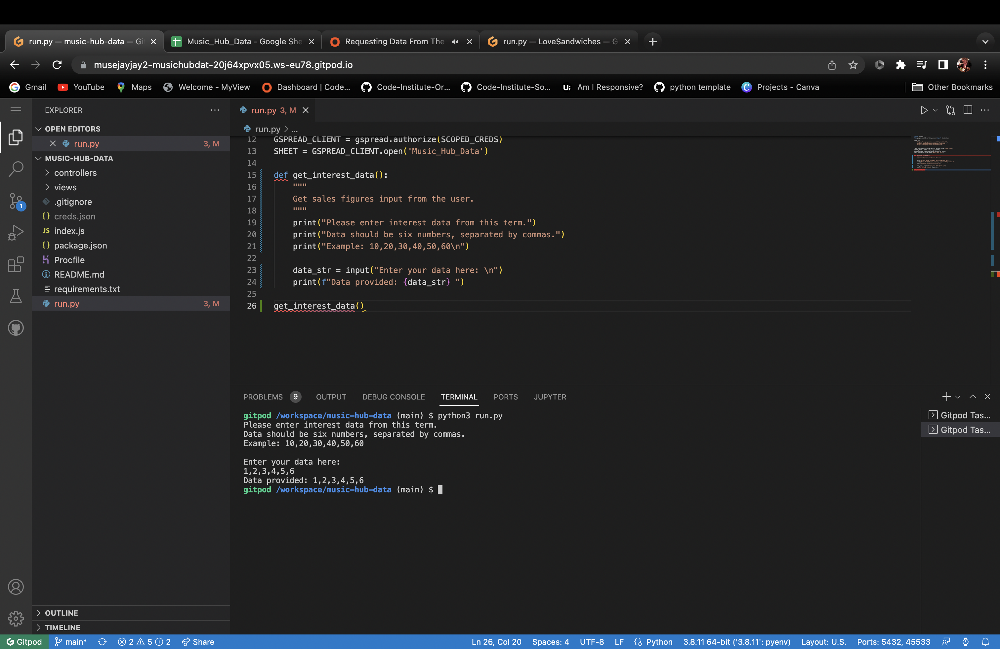
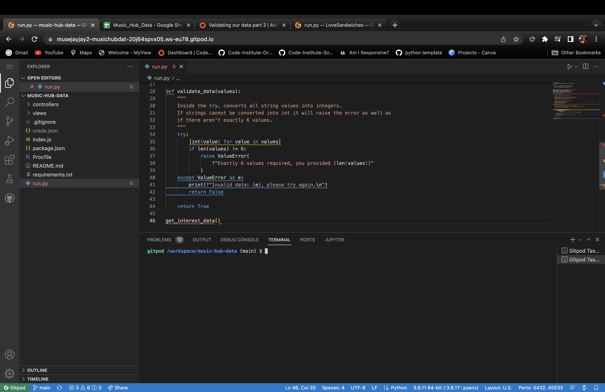

# Music Hub Data

Music hub data is an application that was developed in consultation with a music hub. 
A music hub is responsible for private lessons of pupils in schools throughout their area, providing instruments and tutors.

The problem was they didn’t have a quick way to check what stock/surplus they currently have of each instrument or a way of looking at the last few data entries and predicting what the interest may be next time, 
adjusting stock levels accordingly.
This resulted in the borrowing of instruments from other areas. 

The app links to a google sheet, requesting the current terms interest data for each instrument. 
It then appends this, when valid data is given, to the worksheet in question. The app also takes an average of the last 5 entries for interest data and calculates a predicted amount of interest for the next term based on this. 
This should help the music hub to determine where to buy more instruments etc.

## Features

### Link to Google Sheet Using API's

The project links to an external google sheet that stores the data inputted and generated by the application. I have used google apis to do this, importing them into the run.py file. The links work great and update the spreadsheet as predicted.

### Retrieve Data from the Google Sheet

The application needs the data from the google sheet to create an average, it gets this information using the SHEET.worksheet(worksheet) function which defines which worksheet to pull the data from using an f string, negating the need for multiple identical functions.

### Data input

The user data input is done in the terminal. There are examples of the data type expected by the programme as well as a robust value error system that feedbacks to the user if something isnt right i.e the data set is 7 values etc. There are also feedback print statements throughout the application process to keep the user informed as to the status of their request.

### Calculate Surplus Data

The application calculates the surplus data by using the data inputted from the user and retrieving the data in the stock worksheet of the google drive. This is just using a simple subtract function of these two data sets.

### Calculate Stock Data

The application also calculates an average of the last 5 data inputs for interest. It first collects this data using a function SHEET.worksheet("interest") with the column range of (1,7) to get the right data. Another function then adds these together and divides it by the length of the data set.  Finally, it adds 10% to help negate any excess interest above the average to help prevent the need to borrow instruments from any other places.

## Testing 

I have manually tested the project using the following:

Passed the code through a PEP8 linter and confirmed there are no problems.
I have passed the application invalid inputs in mulitlple ways to test teh error system
Tested in my local terminal and the code institute heroku terminal

## Bugs

I had a couple of bugs such as:

I had set the parameters wrong for retrieval of the last 5 data inputs to calculate the average. Instead of using (1,7) I was using 5. This was picked up by printing the variable to the console and finding the error.

When coding the update worksheet function I was getting error mesages and incorrect values when running the code. I had, in the main(), forgotten to change the inputted worksheet type on the function call and so this was corrected. 

## Validator Test

No errors returned

## Deployment 

The app was deployed using the code institute mock heroku terminal:

- Created a new heroku app
- Set buildpakcs to python and node,js in this order
- Linked this to my github repository
- Turn on autmomatic updates
- Click deploy

### Credits

- Code institute for the mock terminal
- Love sandwiches walkthrough project gave an outline as to how I wanted to solve the problem posed by the music hub